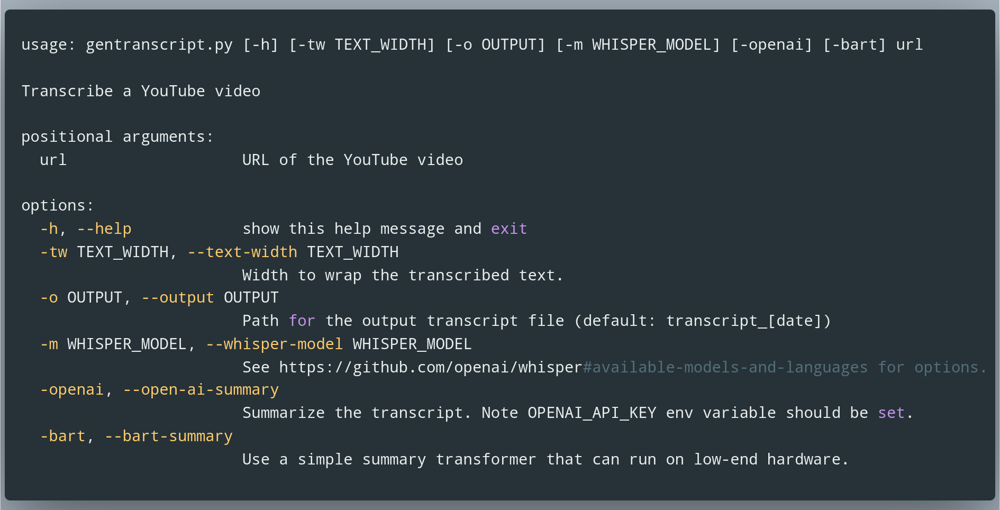
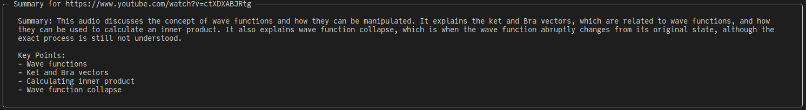

# YouTube Text Transcripts: PyTube+OpenAI-Whisper

> Pass in the YouTube url and ouput file name to generate a transcript of the audio.

## Usage

[](https://carbon.now.sh/?bg=rgba%28171%2C+184%2C+195%2C+1%29&t=material&wt=none&l=application%2Fx-sh&width=995&ds=true&dsyoff=20px&dsblur=68px&wc=false&wa=true&pv=9px&ph=4px&ln=false&fl=1&fm=Droid+Sans+Mono&fs=14.5px&lh=150%25&si=false&es=2x&wm=false&code=usage%253A%2520gentranscript.py%2520%255B-h%255D%2520%255B-tw%2520TEXT_WIDTH%255D%2520%255B-o%2520OUTPUT%255D%2520%255B-m%2520WHISPER_MODEL%255D%2520%255B-ai%255D%2520url%250A%250ATranscribe%2520a%2520YouTube%2520video%250A%250Apositional%2520arguments%253A%250A%2520%2520url%2520%2520%2520%2520%2520%2520%2520%2520%2520%2520%2520%2520%2520%2520%2520%2520%2520%2520%2520URL%2520of%2520the%2520YouTube%2520video%250A%250Aoptions%253A%250A%2520%2520-h%252C%2520--help%2520%2520%2520%2520%2520%2520%2520%2520%2520%2520%2520%2520show%2520this%2520help%2520message%2520and%2520exit%250A%2520%2520-tw%2520TEXT_WIDTH%252C%2520--text-width%2520TEXT_WIDTH%250A%2520%2520%2520%2520%2520%2520%2520%2520%2520%2520%2520%2520%2520%2520%2520%2520%2520%2520%2520%2520%2520%2520%2520%2520Width%2520to%2520wrap%2520the%2520transcribed%2520text.%250A%2520%2520-o%2520OUTPUT%252C%2520--output%2520OUTPUT%250A%2520%2520%2520%2520%2520%2520%2520%2520%2520%2520%2520%2520%2520%2520%2520%2520%2520%2520%2520%2520%2520%2520%2520%2520Path%2520for%2520the%2520output%2520transcript%2520file%2520%28default%253A%2520transcripts%252Ftranscript_%255Bdate%255D%29%250A%2520%2520-m%2520WHISPER_MODEL%252C%2520--whisper-model%2520WHISPER_MODEL%250A%2520%2520%2520%2520%2520%2520%2520%2520%2520%2520%2520%2520%2520%2520%2520%2520%2520%2520%2520%2520%2520%2520%2520%2520See%2520https%253A%252F%252Fgithub.com%252Fopenai%252Fwhisper%2523available-models-and-languages%2520for%2520options.%250A%2520%2520-ai%252C%2520--open-ai-summary%250A%2520%2520%2520%2520%2520%2520%2520%2520%2520%2520%2520%2520%2520%2520%2520%2520%2520%2520%2520%2520%2520%2520%2520%2520Summarize%2520the%2520transcript.%2520Note%2520OPENAI_API_KEY%2520env%2520variable%2520should%2520be%2520set.)

## Intended use cases
- Filter out what to watch.
- Attach transcripts of YouTube video entries in bib. manager (e.g. Zotero). Make oral communication citable!
- Use LLM models, such as GPT, to summarize and extract specific information.

## Example

For illustration purposes I'm just picking a video by [Sabine Hossenfelder](https://www.youtube.com/@SabineHossenfelder) explaining bra-ket notation. To get the audio transcript of the video along with a summary from GPT, you would do the following:

```python
python gentranscript.py https://www.youtube.com/watch?v=ctXDXABJRtg -ai
```



This will also generate `.txt` file with the date in the folder [transcripts](transcripts).

## Requirements
See [requirements.txt](requirements.txt].

The OpenAI-whisper package require [ffmpeg](https://ffmpeg.org/) be instaleld on your system.

## Notes
- You need to specify your `OPENAI_API_KEY` if you plan to use the `-ai` flag.
> **Warning**
> Be mindful of API usage cost!
- The function `gpt_summarize_key_points` uses the function `split_text_into_chunks` to break-up large amounts of text which usually would be rejected by a gpt model. However, the current implementation makes many request and thus appears to also get rate limited by the openAI servers.

## Acknowledgements
I got the idea for this from the video https://www.youtube.com/watch?v=2936_Y80nUk&t=554s by Andy Stapleton.
